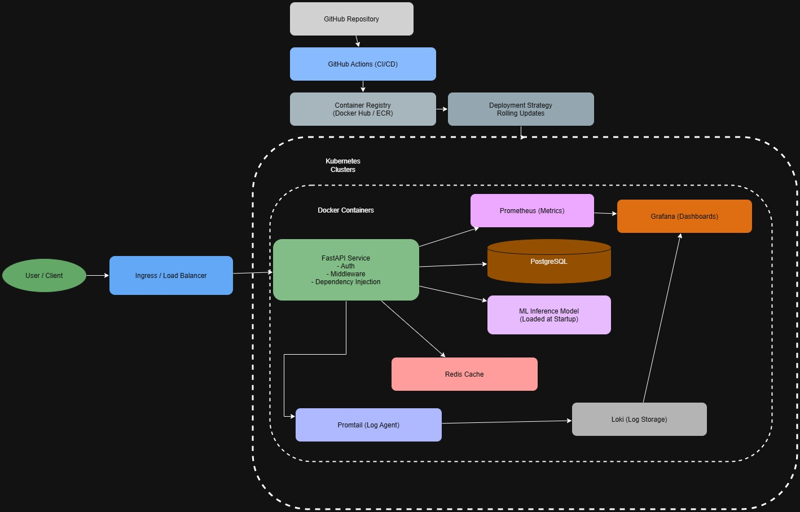

## A04 Model Deployment Capstone Project -> Iris Project Architecture

## Overview

This repository implements a production-ready ML inference system using modern backend, containerization, orchestration, monitoring, and observability best practices.
The system is designed to ensure secure deployment, high availability, controlled model releases, and deep observability for machine learning workloads.

**The architecture focuses on:**

Scalable API-based ML inference

Safe model deployment strategies

Containerized microservices

Robust monitoring, logging, and alerting

Reliability and debuggability in production environments

## High-Level Architecture

## Core Components

**FastAPI** – Serves ML inference requests and exposes REST APIs

**ML Model** – Loaded once at application startup for low-latency predictions

**PostgreSQL** – Persistent storage for user data and metadata

**Redis** – Caching layer to reduce repeated computations

**Docker** – Containerization of all services

**Kubernetes** – Orchestration, scaling, and service management

**Ingress / Load Balancer** – External traffic routing

**GitHub Actions** – CI/CD automation

**Container Registry** – Storage for versioned Docker images

**Prometheus** – Metrics collection

**Grafana** – Metrics visualization

**Promtail + Loki** – Centralized logging

## Containerization Strategy

**All services are packaged as Docker images following best practices:**

Minimal base images (e.g., python:slim)

Explicit dependency pinning

Environment-based configuration using .env

Stateless containers (no local persistence)

Separate containers for:

API service

Databases

Caching

Monitoring tools

Container Registry Best Practices

Docker images are pushed to a container registry as part of the CI/CD pipeline.

## Best practices followed:

Images are immutable

Each image is versioned (e.g., commit hash or semantic version)

latest tag is avoided in production

Rollbacks are possible by redeploying older image versions

Registry access is secured via credentials or tokens

## CI/CD Pipeline

The CI/CD pipeline is implemented using GitHub Actions.

**Pipeline Flow:**

1. Code pushed to GitHub

2. Automated tests executed

3. Docker image built

4. Image pushed to container registry

5. Kubernetes deployment updated

6. Health checks validate rollout

This ensures repeatable, auditable, and safe deployments.

## Controlled Deployment Strategy for ML Models
## Selected Strategy: Canary Deployment
**Why Canary Deployment?**

**Canary deployment is particularly suitable for ML systems because:**

1. ML models can behave unpredictably on real-world data

2. Offline validation does not guarantee production performance

3. Silent failures (e.g., degraded predictions) are common

**With canary deployment:**

A small percentage of traffic is routed to the new model version.The majority of users continue using the stable version. Performance is observed before full rollout. Risks Reduced by Canary Deployment.

**Canary deployment significantly reduces the following risks:**

1. Model performance regression

2. Increased latency due to larger models

3. Unexpected errors from feature mismatches

4. Data distribution drift

5. Production-wide outages

**If issues are detected:**

1. Traffic can be immediately reverted

2. No redeployment is required

3. Business impact is minimal

4. Observability and Reliability

The deployed ML service is designed to be observable, stable, and reliable.

## Metrics Monitoring (Prometheus + Grafana)
Key Metrics Tracked
1. Latency

Request processing time

Model inference duration

Indicates performance degradation

2. Error Rate

HTTP 4xx and 5xx responses

Model inference failures

Serialization/deserialization issues

3. Availability

Uptime of API service

Health check success rate

Kubernetes pod readiness

4. Resource Utilization

CPU usage

Memory usage

Helps prevent out-of-memory errors for ML workloads

These metrics are scraped by Prometheus and visualized using Grafana dashboards.

## Logging Strategy (Promtail + Loki)
Centralized Logging

All application logs are:

Structured (JSON-based)

Collected by Promtail

Stored in Loki

Visualized via Grafana

**Logs provide critical insights such as:**

Incoming request payloads

Model prediction outputs

Exception stack traces

Database connection issues

Cache misses or timeouts

**This enables:**

Faster root-cause analysis

Correlation with metrics

Debugging without direct container access

## Alerting Strategy

Alerts are triggered when system health deviates from acceptable thresholds.

When Alerts Should Be Triggered

Alerts should be raised when:

Latency exceeds SLA thresholds

Error rate spikes above baseline

Service availability drops

Pods repeatedly crash or restart

Memory usage approaches limits

Model inference time increases significantly

**Alerts ensure:**

Rapid incident response

Minimal downtime

Protection against silent ML failures

## Kubernetes Best Practices Applied

Stateless services

Readiness and liveness probes

Horizontal scalability

Rolling updates

Resource limits and requests

Separation of concerns between services

Security and Stability Considerations

Secrets managed via environment variables or Kubernetes secrets

No credentials hardcoded

HTTPS termination at ingress

Controlled rollout of new model versions

Safe rollback mechanisms

## System Architecture

The following diagram illustrates the end-to-end production architecture of the ML inference system, including API services, container orchestration, CI/CD, monitoring, and logging.

## Conclusion

This system demonstrates a production-grade ML deployment architecture that emphasizes:

Safe and controlled model releases

High observability

Strong reliability guarantees

Modern DevOps and MLOps practices

The design ensures that ML models can be deployed, monitored, and iterated upon without risking system stability or user trust.
